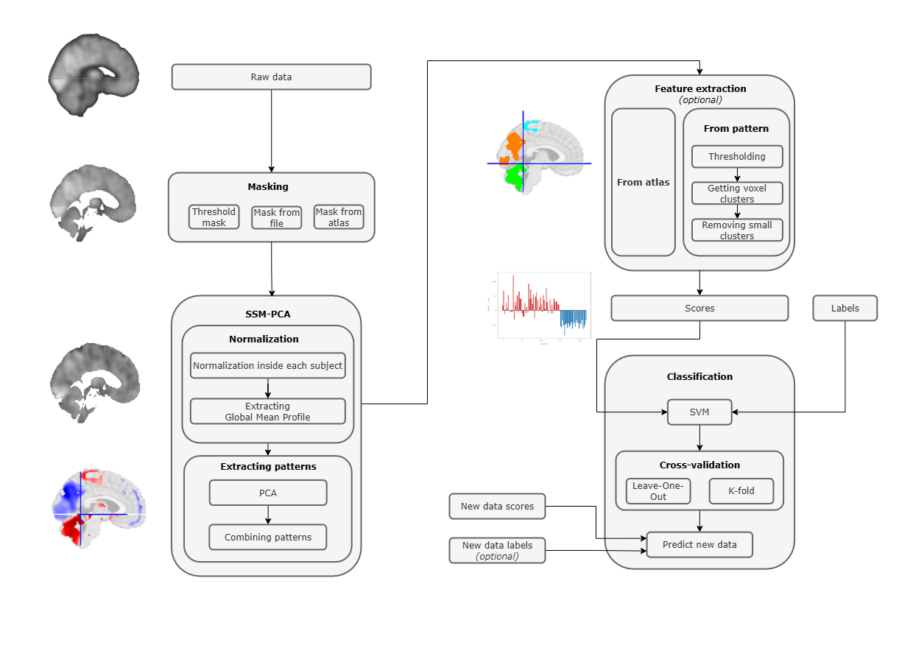

# PIE Toolbox (Pattern Identification and Evaluation)



PIE Toolbox is a Python package designed for processing, analyzing, and classifying voxel data. It offers tools for data preprocessing, feature extraction, pattern identification, and evaluation. The core methods implemented in this package are SSM-PCA (Scaled Subprofile Model of Principal Component Analysis) and SVM (Support Vector Machine).

***

## Project Structure

```
.
├── pie_toolbox/               # Main source code of the program
│   ├── core/                  # Core of the program (main functions and classes)
│   ├── workflows/             # Workflow scripts for data processing and analysis
├── LICENSE.txt                # MIT license
├── log/                       # Folder for log files (created automatically)
├── config/                    # JSON files with pipeline configurations
├── example_generate_data.py   # Example data generator
├── example_pipeline.py        # Pipeline usage example
├── README.md                  # This file
└── requirements.txt           # List of dependencies

```


## Project Configuration

All project parameters, from data paths to model hyperparameters, are specified in json files in the config/ directory. This allows for easy reproducing of experiments and project customization.

example_data_config.json: Contains settings for the example pipeline, including parameters for the SSM-PSA and classifier.


***

## Installation and Getting Started

It is recommended to use a virtual environment when working with this project.

1. **Clone the repository:**

```bash
git clone git@github.com:IHB-IBR-department/PIE_toolbox.git
cd pie_toolbox
```

2. **Create and activate a virtual environment:**

For Linux/MacOS:
```bash
python -m venv venv
source venv/bin/activate
```

For Windows:
```bash
python -m venv venv
venv\Scripts\activate
```

3. **Install dependencies:**

```bash
pip install -r requirements.txt
```


***

## Usage

To utilize the package's functionality in your scripts, import the relevant modules.
The `workflows` folder contains scripts designed for data processing and analysis, such as:
- `image_dataset.py`: Manages image datasets and related operations.
- `ssm_pca.py`: Implements the Scaled Subprofile Model of Principal Component Analysis.
- `feature_extraction.py`: Provides tools for extracting features from datasets.
- `classification.py`: Contains classification algorithms like Support Vector Machine.
- `export.py`: Handles exporting of results and data.

### Example of using `pie_toolbox`:

The script `examples/example_data_pipeline.py` demonstrates the main functions of PIE Toolbox using `example_data`.

You can run the script with the following command:
```bash
python example_pipeline.py
```
The results will be saved in the `example_data/results` directory.


***

## Example Data

The project also includes an `example_data/` folder containing example datasets. These datasets consist of generated data.

You can use the data in `example_data/` to try out the functions and workflows provided in the package, facilitating easier validation and understanding of the analysis steps on controlled sample inputs.

## Testing

To verify the correctness of the code, built-in unit tests are provided. Run them from the root folder of the project:

```bash
python -m pytest
```
